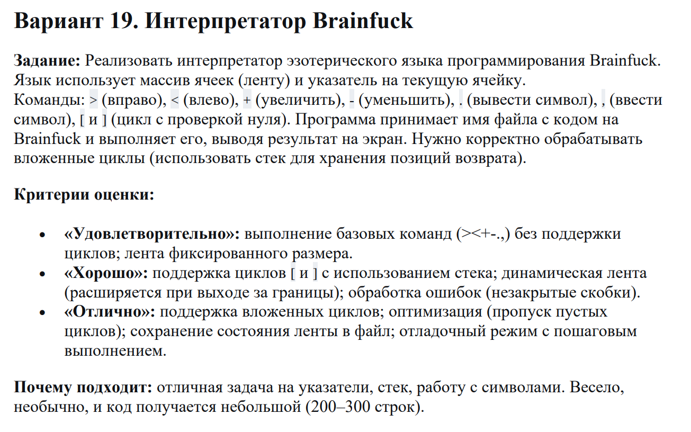
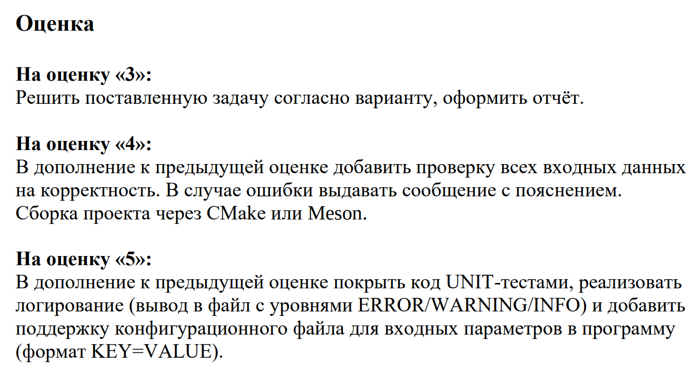

# расчетно графическая работа по программированию

## ВАРИАНТ №19. Интерпретатор Brainf*ck


- Требования к работе на каждую из оценок


- [ПАПКА]() с примерами для интерпретации

## ИНСТРУКЦИЯ ПО УСТАНОВК

- 1. Установка зависимостей (Ubuntu/Debian)
```bash
sudo apt update && sudo apt install -y gcc cmake make libcmocka-dev git
```

- 2. Клонирование и сборка
```bash
git clone https://github.com/M4llone/Programming/tree/main/RGR_interpreter
cd Programming/RGR_interpreter
mkdir -p build && cd build
cmake .. && cmake --build .
```

- 3. Запуск программы
- Запустите интерпретатор:
```bash
/RGR_interpreter/build$ ./brainfuck ../BFtest/text_n.bf 
```
n - номер примера

- 4. Запуск Unit-тестов
```bash
./test_runner
```

