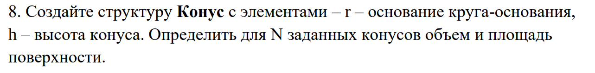
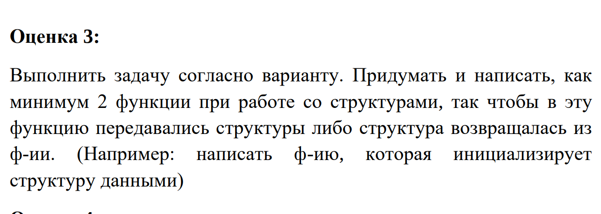
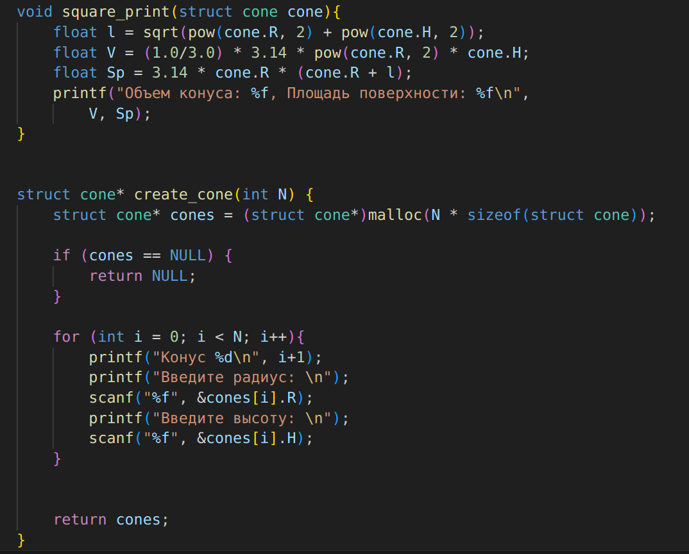
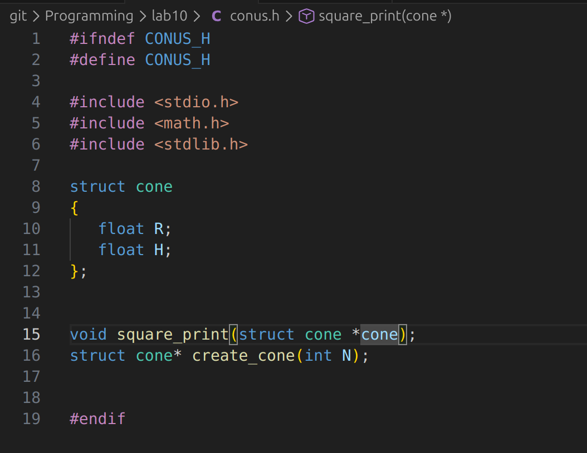
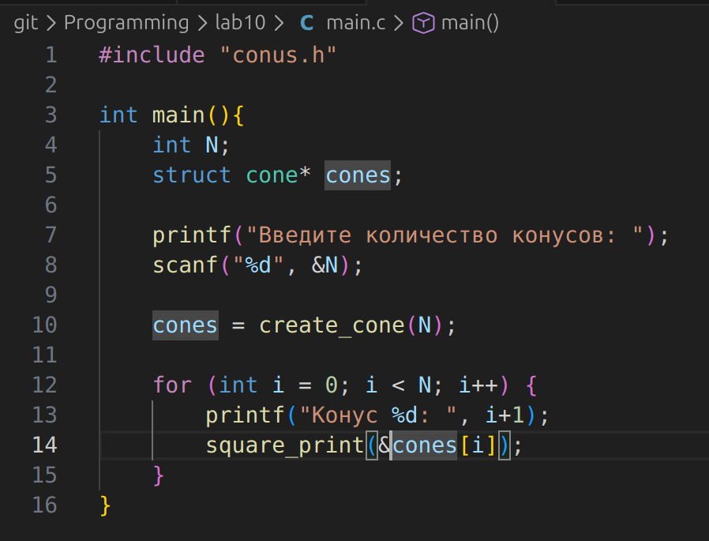
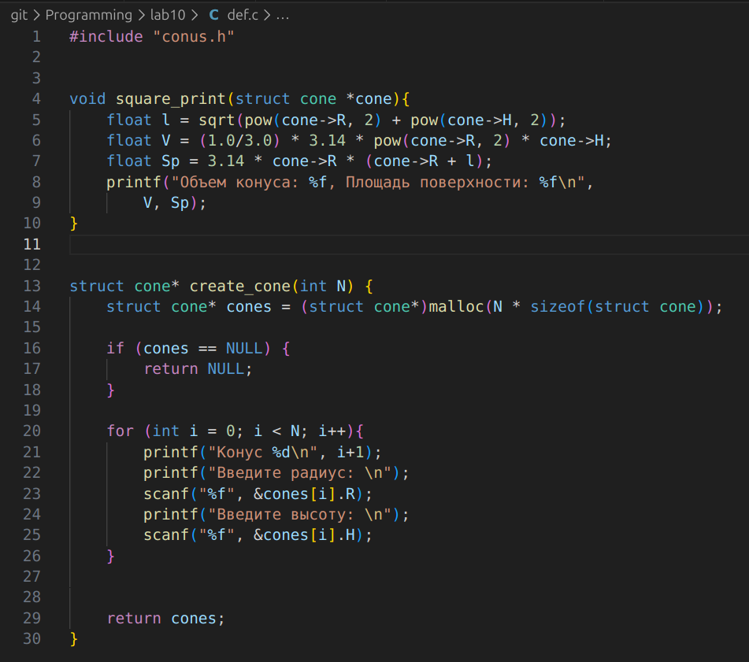
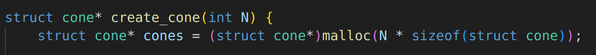

# Вариант №8

# Задание на 3
- условие задания

- код выполнения

# Задание на 4
- файл .h 

- файл main.c

- файл def.c

# Задание на 5

- создаем указатель на массив структур
- выделяем память для N структур
