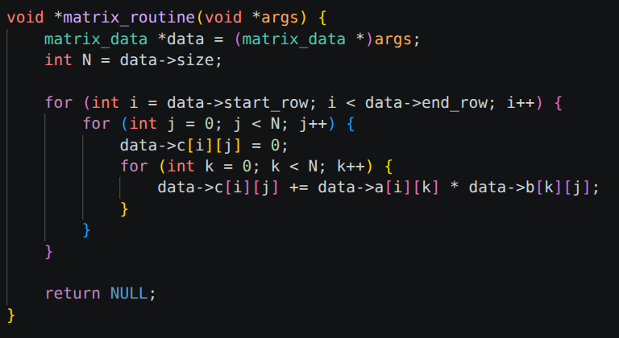
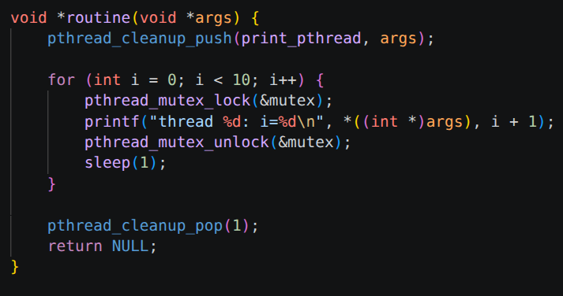
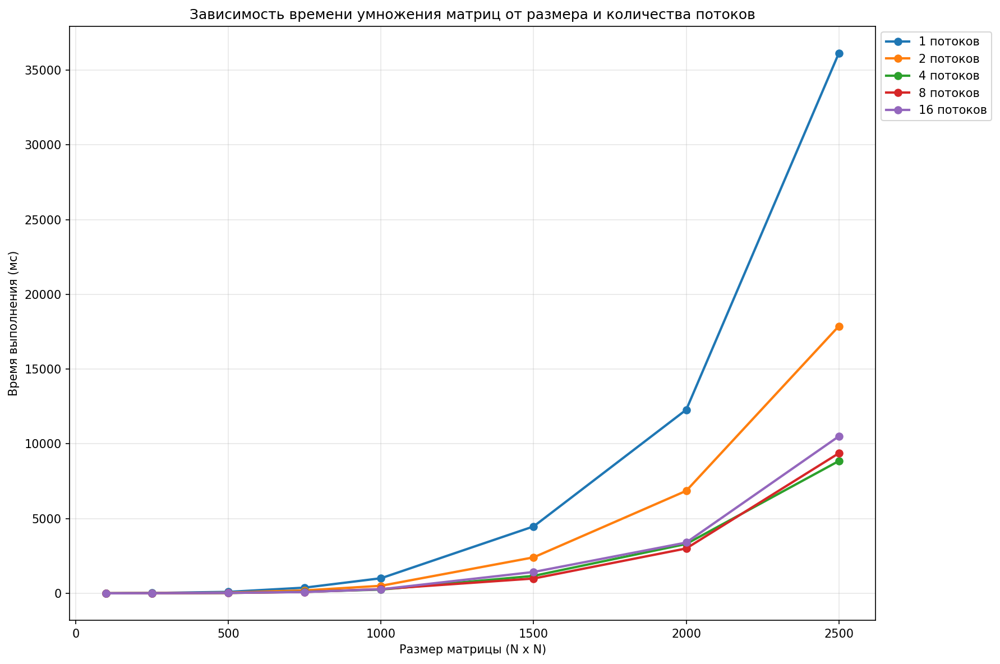

# ВЫПОЛНЕНИЕ ЗАДАНИЯ НА 4
- ФУНКЦИЯ УМНОЖЕНИЯ МАТРИЦЫ

данные идут из структуры matrix_data
- ФУНКЦИЯ ПОТОКА

синхронизация работы потоков
- ТАБЛИЦА ЗАВИСИМОСТИ

по графику можно сделать вывод что 8 потоков лучший вариант
